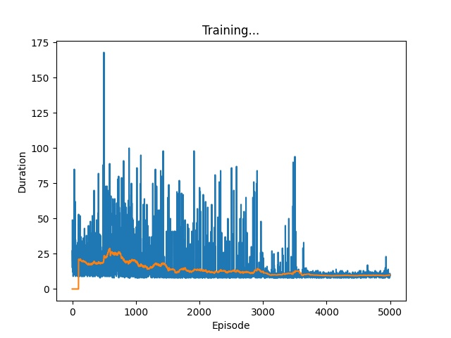
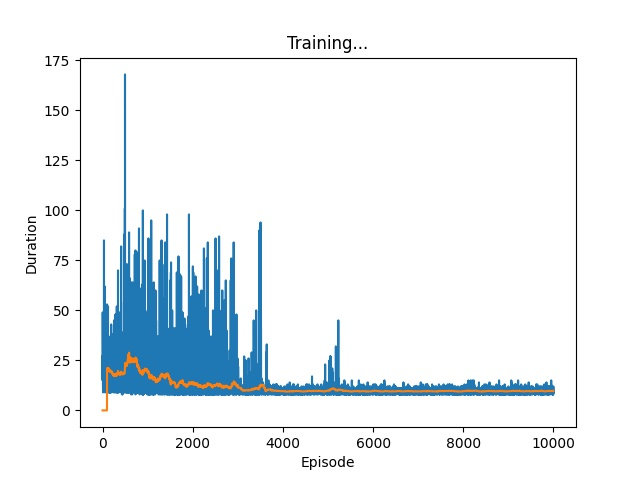
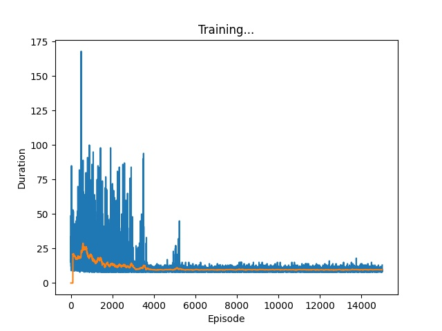

# experiment1-CartPole_v0


gym.env.observation = {position of cart, velocity of cart, angle of pole, rotation rate of pole}(位置，车速，杆角度，杆转速)


***Algorithm implementation of Determinate policy is like third type at picture.***


## 1. DQN algorithm implemented by official PyTorch

See [torch_official_DQN.py](./torch_official_DQN.py) and [torch_official_DQN](./torch_official_DQN/).

## method

- q learning(off-policy, TD(0))
- Model, Convolutional Neural Network,  outputs the estimation of q values per action directly(two output values, because of fixed two selective action per state)
- Use episodes cache called memory to store samples with fixed-length of timesteps according to maintaining a queue, dropping out prior samples, adding new samples when agent performs action and then environment returns successive state and reward. When optimize policy, extract a set number of stochastic samples from memory for updating parameters. Length of queue is 10000.
- episode equals to 20000.
- Use hand-engineered state features, by clipping current timestep window centered around the vehicle from original screen rendered calling gym.env.render minus clipping last timestep window, instead of gym.env.observation. Writer maybe thinks prior hand-engineered state features can present variation of velocity of cart, angle of pole, rotation rate of pole, but at least ignore location of cart due to the absence of a reference. Shows one timestep's origin screen, clipping current timestep window and the result of clipping current timestep window minus last window as follow: 


- Furthermore note that timestep length is a constant equivalent to 0.01. In general, when scene is a unequilibrium problem, set timestep length α a constant. I think CartPole_v0 more possibly is an equilibrium problem, but TD series are unbiased estimator. On account of prior samples with more estimating error, it's reasonable to set a constant timestep length to decrease the weight of prior samples.

### Results

*Reinforcement learning An Introduction Second Edition* and David Silver said, nonlinear off-policy Reinforcement learning might diverges... As the results appeared, no convergence.


### Idea

I cannot confirm it is 'three deadly elements' brought out the divergence, and might be the inappropriate hand-engineered state features. So try to change the hand-engineered state features.


## 2.DQN改特征版

见[picf_qlearning_cnn.py](./picf_qlearning_cnn.py)和[experiment2](./experiment2/)

### 方法

- 和上面实验1唯一区别是改了状态特征，提取窗口再也不是只取中间部分了，只对原始屏幕做上下部分剪切，再插值，这样可以体现小车的位置。为了体现车速，杆速变化，将动作执行前状态（提取窗口）和执行后状态都作为特征共6维（实验1为3维）都加入模型，可视化如下，分别为原始屏幕和提取状态：


### 实验结果

结果依然不收敛...查了强化学习导论，书上说只要致命三要素都满足，一定会发生发散或不稳定的情况，三要素分别为：1.使用函数逼近（function approximation）；2.使用自举法（Bootstrapping）；3.使用离轨学习（off-policy）。DQN刚好都满足...


为了再次验证是模型在此场景无效的原因或是特征构造的原因，下个实验直接使用gym.env.observation作为特征。


## 3.NN-Q_learning版

见[envf_qlearning_withm.py](./envf_qlearning_withm.py)和[experiment3](./experiment3/)

### 方法

- 直接使用gym.env.observation作为特征
- 将卷积网络替换为全连接网络
- 改memory队列长度=batch_size=128(因为认为过去的估计值有更大的误差，所以不能记忆太久)，改episode为2000

### 实验结果

结果依然不收敛...所以不是特征的问题。


发现了一个问题，当环境结束时，就是done == True时，reward也同样等于1，这样是不是会导致学习认为这个行为也是有效的，而分不清哪些行为是无效的，哪些是有效的？下个实验将done == True时的reward设为-100。


## 4.NN-Q_learning改最终状态回报版

见[envf_qlearning_withm.py](./envf_qlearning_withm.py)和[experiment4](./experiment4/)

### 方法

- 方法同实验3
- 改最终状态回报为-100

### 实验结果

结果依然不收敛...所以不是最终态回报的问题。


## 5.NN-Expected_Sarsa最终状态回报为-100

见[envf_esarsa_withm.py](./envf_esarsa_withm.py)和[experiment5](./experiment5/)

### 方法

- 将最终状态回报改回1(后面发现实际忘记改了，还是-100)
- 直接使用gym.env.observation作为特征
- 网络结构同实验3
- 取消离轨学习(off-policy)，替换为同轨学习(on-policy)的期望sarsa(expected-sarsa)
- memory为batch_size，episode为2000和memory为10000，episode为20000都尝试

### 实验结果

memory为batch_size，episode为2000和memory为10000，episode为20000都试过，结果都是不收敛...以下展示memory为10000，episode为20000的结果


实现上存在错误，详见实验6说明


## 6.NN-MC

### part1

见[envf_mc.py](./envf_mc.py)

#### 方法

- 其他同实验5
- 将最终状态回报改回1
- 替换方法为同轨MC(Monte-Carlo)
- 取消记忆机制，以每个episode为bacth进行训练，每个batch仅进行一次更新(即方向传播一次便丢弃)
- 修改EPS_DECAY = num_episodes / 2 (之前大概100-500之间)，其他计算epsilon的参数没变

```python
num_episodes = 20000
GAMMA = 0.999
EPS_START = 0.9
EPS_END = 0.05
EPS_DECAY = num_episodes / 2
steps_done = 0  # 没执行一次动作选择，steps_done += 1

# epsilon greedy policy
epsilon = EPS_END + (EPS_START - EPS_END) * math.exp(-1. * steps_done / EPS_DECAY)

# steps_done = 0, epsilon = 0.9
# steps_done = 100, epsilon = 0.8915423586867929
# steps_done = 1000, epsilon = 0.8191118053305656
# steps_done = 5000, epsilon = 0.5655510607557385
# steps_done = 10000, epsilon = 0.36269752499572594
# steps_done = 20000, epsilon = 0.1650349907511208
# steps_done = 100000, epsilon = 0.05003858994029811
```

#### 实验结果

跑了两次，一次大概在400个episode的时候收敛了，一次大概在700个episode的时候收敛了。***NICE!!!!!!!!!!!!!!!!!!!***因agent这次一直没失败，大概稳了4个多小时了都没失败，所以就没画图

之后又跑过若干次，有两次是在2000episode以下就收敛，有一次到了快4000还未收敛，所以也不一定能稳定收敛，不过记忆中收敛前都出现了1个或多个duration持续时间很长的episode

#### 意外发现

- 发现了一个***bug!!!!!!!!!!!!!***，可能导致没收敛，在实验4结束后，忘记改最终状态回报从-100到1了，导致复制过去在基础上进行修改的expected-sarsa脚本也继承了该错误。这个错误可能会导致不收敛，因为在MC中一开始也有这个错误，模型就没有收敛(大概跑了一次)，但是原因无法解释，为什么我们要给导致失败的(a|s)一个正的回报呢？
- EPS_DECAY可能影响收敛

我认为是上面两点（可能第一点更重要）影响了MC的收敛，因此应该修改bug后重新跑期望sarsa，也重新试试q_learning(q_learning虽然不一定能稳定收敛，但是记得有次运行agent也很长时间都没有失败，可能这次收敛了，只是后面运行再没收敛成功过)。**从新反复试了几次，发现最后一步给-100回报就是会导致不收敛，给1的回报一定会收敛**。

- 关于epsilon有一点我搞错了，应该是贪心行为有(1 - epsilon) + epsilon / count(action)的概率被选择，其他行为有epsilon / count(action)的概率被选择，期望sarsa实现时也有这个错误，而且对于期望sarsa的next_state的动作选择几率steps_done应该等于当前state的steps_done加1

### part2

见[envf_mc_recycle_best_memory.py](./envf_mc_recycle_best_memory.py)

#### 方法

- 其他同实验6part1
- 增加优质记忆反复进行梯度下降的机制，维护一个优先级队列，储存duration排名前n(本实验是40)的episode，每40个episode之后就循环一此这些优质记忆

#### 实验结果

目前只跑了一次，大概400个episode时候收敛，这次小车稳在了正中间，这一次收敛到了最接近真实动作价值函数的位置


## 7.多个NN-Expected_Sarsa实验

见[envf_esarsa_withm.py](./envf_esarsa_withm.py)和[experiment7_part1](./experiment7_part1/)

### part1

#### 方法

- 其他同实验5
- 修改实验6提到的bug
- 将最终状态回报改回1

#### 实验结果

至少在20000个episode中未收敛，虽然最后几个episode有稳定的迹象


### part2

见[envf_esarsa_nomemory.py](./envf_esarsa_nomemory.py)

#### 方法

- 其他同本实验part1
- 取消记忆机制，以每个episode为bacth进行训练，每个batch仅进行一次更新(即方向传播一次便丢弃)

#### 实验结果

收敛，一共运行了两次，一次是在5000episode左右收敛，一次是在8900左右收敛，证明丢弃掉记忆机制是正确的。其中第一次收敛小车稳在了很靠近中心的位置，第二次在靠右边的位置，MC总是稳在靠边上的位置，所以从价值函数预测的角度看，期望sarsa预测的价值函数更准(因为车越靠近中心，价值越大)，只是收敛的速度比MC慢许多，这和强化学习导论里提到的经验相反

### part3

见[envf_qlearning_nom.py](./envf_qlearning_nom.py)和[experiment7_part3](./experiment7_part3/)

#### 方法

- 其他同实验3
- 取消记忆机制，以每个episode为bacth进行训练，每个batch仅进行一次更新(即方向传播一次便丢弃)

#### 实验结果

未收敛，推测可能和更新目标策略的频率相关，或者没有加入重要度采样、关注度的离轨确实不易收敛


### 意外发现

- 发现了一个***bug!!!!!!!!!!!!!***，可能导致没收敛，去掉记忆机制的TD实现错误了，包括期望sarsa和q learning，应该在每个episode的每个时间步都进行训练更新权重，但是是在每个episode之后才进行的，像MC一样，从来一次！！！！！

### part4

见[envf_esarsa_nomemory.py](./envf_esarsa_nomemory.py)和[experiment7_part4](./experiment7_part4/)

#### 方法

- 其他同本实验part2
- 在每次进入下一个状态后就更新权重
- 为了适应TD(0)的结构，nn中要去掉batch normalization

#### 实验结果

改成真实的TD(0)形式后反而不收敛了


### part5

见[envf_qlearning_nom.py](./envf_qlearning_nom.py)和[experiment7_part5](./experiment7_part5/)

#### 方法

- 其他同本实验part3
- 在每次进入下一个状态后就更新权重
- 为了适应TD(0)的结构，nn中要去掉batch normalization

#### 实验结果

改成真实的TD(0)形式后反而不收敛了








## 8.self-picture-feature-CNN-MC

见[picf_MC_cnn.py](./picf_MC_cnn.py)和[experiment7_part5](./experiment7_part5/)

### 方法

- 其他同实验6
- 特征换为实验2特征
- 模型换为实验1、2模型CNN

### 实验结果

未收敛。


全程都比较平稳，说明构造的特征太暴力了，因为人脸识别也是先出现目标检测，检测到人脸，然后把人脸抠出来，才做分类，所以官方构造的图像也有一定道理，只是他不能表征位置的概念，这是一个弱点，或许可以尝试改进官方特征，或者参考吃豆人等游戏是如何构建输入图像特征的。


## 9.official-picture-feature-CNN-MC

之所以重新尝试官方图像特征，是因为官方图像特征小车位于正中间，和人脸识别整个图像只有一张脸如出一辙，只是官方特征一定缺少位置信息，可能缺少速度信息

### part1

见[official_picf_MC_cnn.py](./official_picf_MC_cnn.py)和[experiment9_part1](./experiment9_part1/)

#### 方法

- 其他同实验8
- 特征换为torch官方图像特征

#### 实验结果

未收敛。


不知道除了和缺少位置信息特征有关，和缺少速度特征是否也有关(不确定官方构建的图像特征能否表征速度信息)，下个实验加入位置信息，看是否收敛

### part2

见[official_picf_MC_cnn_with_envf.py](./official_picf_MC_cnn_with_envf.py)和[experiment9_part2](./experiment9_part2/)

#### 方法

- 其他同实验9part1
- 增加env返回的位置信息，并改网络使其适应新的输入

#### 实验结果

依然没有收敛


可能是缺少速度特征造成的，下一部尝试加入速度特征

### part3

见[official_picf_MC_cnn_with_envf.py](./official_picf_MC_cnn_with_envf.py)和[experiment9_part3](./experiment9_part3/)

#### 方法

- 其他同实验9part2
- 增加env返回的速度信息

#### 实验结果

依然没有收敛


相比实验9part2并没有明显改善

### 意外发现

- 发现了一个***bug!!!!!!!!!!!!!***，因为实现错误的原因，会导致模型没有训练，不训练的模型在后面的episode中会呈现episode duration差不多为20的现象，反观之前的esarsa，就有这种现象，说明esarsa可能存在没有训练的情况，应检查代码


## 小结

之前的实验主要分为两部分，一部分是使用environment feature，另一部分是使用picture feature

- 使用environment feature的部分中除了正确实现的TD(0)系列算法未收敛，其他都收敛(包括错误实现的TD(0)算法)，因为TD(0)不收敛而不尝试TD(λ)这种思想其实是错误的，TD(λ)的收敛性应该优于TD(0)，而且这里我之前混淆了两个概念即λ-G(return)和TD(λ)，在**TODO**中提到的TD(λ)是指λ-G(return)，λ-G(return)的收敛性也应该是优于TD(0)的
- 使用picture feature的部分都未收敛，首先是因为DQN的实现存在一些问题，应该重点关注DQN的经验回放(memory)问题(TD-Gammon和DQN都使用经验回放机制，应参考原文或原实验)，还有Atari中使用的DQN都是使用**原始图像**作为输入的，或是**原始图像及其之前数帧图像**进行输入的，并非像torch官方那边前后相减


## 10.NN-Expected_Sarsa-TD(λ)-后向资格迹(Eligibility-Traces)版

实现方法参照《强化学习导论》第12章2节

见[envf_esarsa_Eligibility_Traces_nomemory.py](./envf_esarsa_Eligibility_Traces_nomemory.py)和[experiment10](./experiment10/)

#### 方法

- 其他同实验7正确实现的esarsa
- 不添加记忆机制
- 将更新梯度的值换为资格迹向量(Eligibility-Traces)，但是和《强化学习导论》上不一样，因为这里使用了RMSprop优化器，而书上是直接减去梯度(普通的梯度下降法)

#### 实验结果

整个轨迹非常像普通的esarsa


## 11. REINFORCE using environment return state features

See [envf_reinforce.py](./envf_reinforce.py) and [experiment11](./experiment11/).

## method

- Instantiation of this algorithm refer to p322, *Reinforcement learning An Introduction Second Edition*
- Use one episode samples to update params, like Monte-Carlo
- Use SGD with fixed learning rate
- Calculate gradient everytime agent performs action(bad instantiation, because of making parallel task to series)

### Results

Nonconvergence, the problem is uncertain. Seek the problem in frontier study.


## 12. Proximal Policy Optimization(PPO) using environment return state features

See [envf_PPO_main.py](./PPO/envf_PPO_main.py). This implementation is derived from [stable-baselines3(can also see './PPO_from_DLR_RM/' copied from stable-baselines3 with few justified modification)](https://github.com/DLR-RM/stable-baselines3) and made simplification.

## method

- Instantiation of OPENAI default policy gradient reinforcement learing algorithm using Pytorch, seeing [Proximal Policy Optimization Algorithms](https://arxiv.org/abs/1707.06347) and [openai_baselines_ppo1](https://github.com/openai/baselines/tree/master/baselines/ppo1) for more details
- Implement without Entropy(method for encouraging exploration).

### Results

Can converge In 40000 Iterations and 308 episodes. This is the **best result** so far**!!!!!!!!!!!!!!!!!!**


## TODO

- [x] 改获取state的方式
- [x] 直接使用gym.env.observation作为state特征，并使用适应特征的网络结构
- [x] 改最终状态回报为-100
- [x] 替换方法为TD(0)的期望sarsa(expected-sarsa)(on-policy)
- [x] 替换方法为MC(Monte-Carlo)
- [x] 为MC增加优质记忆反复使用的机制
- [x] 重跑期望sarsa和q_learning
- [ ] ~~替换方法为TD(λ)的期望sarsa(expected-sarsa)~~(因TD(0)不收敛，所以暂时不尝试TD(λ))
- [x] 将特征换为自定义图像特征，再跑MC
- [x] 将特征换为torch官方图像特征，再跑MC
- [x] 使用torch官方图像特征外加env返回的位置特征，再跑MC
- [x] 使用torch官方图像特征外加env返回的位置、速度特征，再跑MC
- [x] 加入后向资格迹(Eligibility-Traces)
- [x] Try the classical policy gradient method reinforce
- [x] Try the PPO algorithm